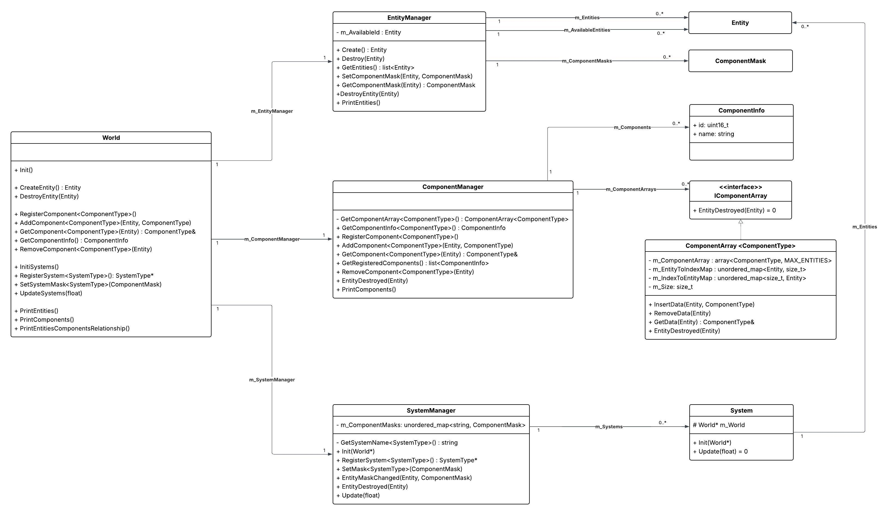
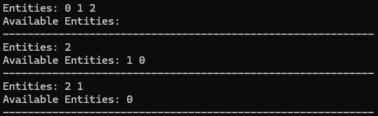
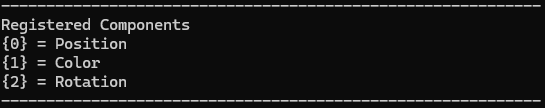
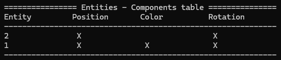

# SimpleECS
A simple Entity–Component–System (ECS) framework inspired by the article [A Simple Entity Component System (ECS) [C++]](https://austinmorlan.com/posts/entity_component_system/) by [Austin Morlan](https://austinmorlan.com/).

The original implementation has been extended with additional functionality not covered in the article, and several classes were refactored to better fit an architecture I use across other projects.

###### Current support: C++ 20 (Projects: Visual studio 2019, XCode, VSCode)

**Usage of the project**
* Clone the repository or download the zip to use this project locally.
* Open the code with your prefer IDE (by default, it was distributed with Visual studio, VSCode and XCode)
* Compile using C++ 20 or posterior

# Class diagram
The following class diagram provides a high-level overview of the classes and relationships within the Entity–Component–System (ECS) framework. Note that the `World` class acts as an orchestrator, delegating method calls to the appropriate managers (`EntityManager`, `ComponentManager`, and `SystemManager`).

# How to use it
Due to the implementation logic and limitations of this framework, there are a few recommended steps to follow to make this work properly.
1. Create a `World`
2. Init the world (using the `Init()` method)
3. Create the Entities (this step can be performed whenever you want). Bear in mind the current implementation only support 2048 entities (`MAX_ENTITIES = 2048`).
You can change this value or can implement chunks. This way, each chunk will support the MAX_ENTITIES value.
4. Register your custom components (e.g. `world.RegisterComponent<Position>();` )
5. Register your custom systems (e.g. `world.RegisterSystem<TranslateSystem>();`)
6. Set the component mask to the system (e.g. `world.SetSystemMask<TranslateSystem>(mask);`) to define the components the system will operate on.
7. Init the system (if requiere).
8. Add component data to the Entities (e.g., `world.AddComponent<Position>(e3, Position{.x = 0, .y = 0, .z = 0});`)
9. Update the systems (e.g., `world.UpdateSystems(0.0f);`)

 ### :warning: **Debugging options** :warning:

A set of methods is provided to print selected operations to the console (std::cout). These can be extended as needed. They were originally implemented to help verify that the ECS framework behaves as expected—after all, there’s no better way to observe what’s happening than directly in the terminal.

## world.PrintEntities()
This method shows the current Entities up and run, additionally, the available Entities (destroyed).
The available Entities will be reused when creating a new Entity.

## world.PrintComponents()
This method will display the _id_ and the _name_ of all the Components registered in the World.

## world.PrintEntitiesComponentsRelationship()
Finally, you can display the relationship between the Entity and the Components. This is a helpful method you can use to debug and visualize the Entities information.
Since I tested a few Components, probably when you add many of them, the table will look odd. You can modify the implementation of this code to adapt it to your needs.

# References
"If I have seen further it is by standing on the shoulders of giants" - Isaac Newton

* [A Simple Entity Component System (ECS) [C++]](https://austinmorlan.com/posts/entity_component_system/) by [Austin Morlan](https://austinmorlan.com/).
* [Data oriented design](https://www.dataorienteddesign.com/dodbook/) by Richard Fabian
* [CppCon 2014: Mike Acton "Data-Oriented Design and C++"](https://www.youtube.com/watch?v=rX0ItVEVjHc) by Mike Acton
* [How to make a simple entity-component-system in C++](https://www.david-colson.com/2020/02/09/making-a-simple-ecs.html) by David Colson